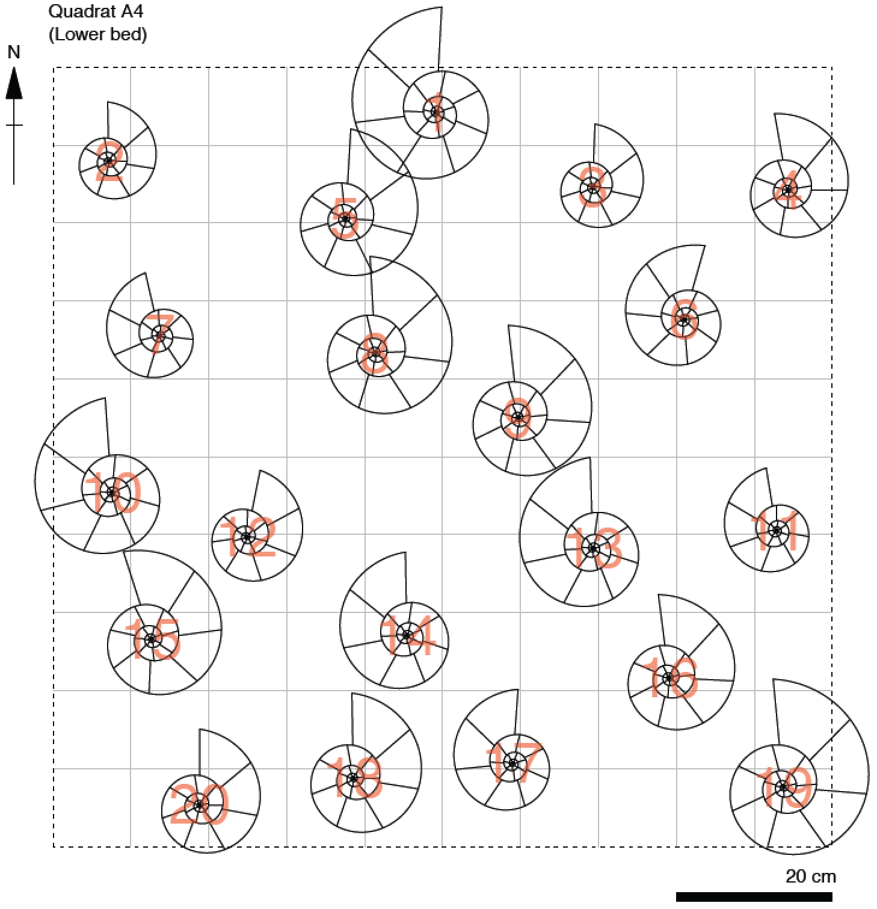

## An introductory statistics course for geologists

### Graeme T. Lloyd

## Introduction

This repository contains materials (lectures, practicals and formative and summative assessments) for teaching introductory statistics to geologists. Aside from basic "standard" statistics (univariate, bivarate, multivariate) the repository also includes some statistics more specific to geology that might be less relevant to other sciences (e.g., circular statistics, plotting stereonets).

## License

These materials are released under a GNU General Public License Version 3 (see LICENSE for details) with the exception of material reused from other sources. Specifically:

* Dinosaur body mass data ([Dryad repositiory for Benson et al. 2018](https://datadryad.org/stash/dataset/doi:10.5061/dryad.1t3r4))
* Meteor impact ages ([Earth Impact Database](http://www.passc.net/EarthImpactDatabase/New%20website_05-2018/Index.html))
* Volcano data ([NOAA Volcano Location Database](https://data.noaa.gov/dataset/dataset/global-volcano-locations-database))

## Format

The course asssumes a standard structure of Lecture + Practical + Formative Multiple Choice Questions (MCQ; with Model Answers), with eight lectures total. However, an additional opening practical and MCQ also cover a basic introduction to the programming language R and the Integrated Development Environment (IDE) ([RStudio](https://rstudio.com/)) - the freely available, multiplatform software on which the practicals are based (and which students can easily install on their personal machines). The practicals use a variety of geologic example data sets (see above), but are primarily based around an ammonite quadrat (see below) which serves as a training data set for the summative assessment (writing a scientific paper-style report on a different ammonite quadrat from higher in the same geologic sequence).

## Ammonite quadrat

In order to create a sense of individual ownership over a data set that could also be used as the basis for a large range of statistical tests a series of ammonite quadrats were generated. The students are told these come from a large wave cut platform representing a Jurassic sea bed. A large ten-by-ten metre quadrat is laid out across this platform and further subdivided into one hundred one-by-one metre quadrats individually lebelled with a letter and a number with each student assigned one of these smaller data sets. I explain that quadrats are used to avoid sampling biases; all ammonites in these grid cells are measured rather than a potentially biased self-selected sample of ammonites (e.g., larger/prettier ones). Each individual data set is unique, in part to avoid plagarism. In reality this data is simulated such that each quadrat contains exactly twenty ammonites (each student has the same number of measurements to deal with), and ammonites are assigned to a quadrat based on the position of their central point (hence most quadrats will contain ammonites that extend outside their one-by-one metre grid cell).

Below is an example quadrat from the Lower Bed the students will start with before encountering the more complex Upper Bed on their own and that forms the basis of the summative assessment.

The students will iteratively learn what measurements they can take from these quadrats, and the Lower Bed quadrats contain a table on their reverse side that students will fill in throughout the practicals. First they will simply measure the size of the ammonites (maximum diameter from top of aperture through the centre - see appropriate slide in Lecture 2). Note that students should find these are normally distributed. Ultimately this will be shown to be unnatural (living populations would more likely be log-normal) and an interpretation that this represents a size fractionation as they settle out of a palaeocurrent is suggested as the probable explanation, linking in some sedimentology. Next they will count the number of chambers and match these against diameters with some bivariate statistics (regression, correlation). Although this will suggest a strong positive correlation (chambers are added as ammonites grow - just like the living *Nautilus*), a more nuanced study of the intercept of a linear regression will show that a straight line relationship is implausible and in fact a curvilinear model fits better (i.e., early chambers are smaller, and get progressively larger as the animal grows - sensibly enough as the animal will live in the final and largest chamber, requiring more and more space as it grows). Next the spatial distribution of ammonites (based on their central points) can be compared to simple models (uniform, random). Students will typically guess that their data are random, but in practice the tests will favour a uniform distribution - the ammonites are more evenly spread out than a random expectation. Ultimately the interpretation put forward for this is that tests based on the (violated) assumption that data represent infinitesimal points mean ammonites are unlikely to stack up on top of each other in the presence of a palaeocurrent that would topple these, leading to the more spread out distribution we find. Thus sedimentology is again invoked, as well as the contrast between "real world" data and mathematical idealisations (nothing is actually infinitesimal). Finally, and this is where the presence of a palaeocurrent is actually introduced, the paper of Lukeneder et al. (2014) is cited, showing that despite being disc-shaped ammonites can be preferentially oriented in the presence of a palaeocurrent. (NB: although this part is true, I state that the ammonite aperture points in the direction of this current whereas in reality it can point with or into the current.) The data are deliberately oriented to the North here to show the failiure of "regular" statistics. I.e., the ammonites are clearly biased towards a Northly direction (suggesting there is a current), but taking a regular mean of the bearings from all twenty ammonites will come out around 180 degrees (i.e., South). Thus circular statistics are introduced alongside their associated basic measures, including the circular mean, that will give the correct answer of a mean close to 0 degrees.

(Note that even more analyses are possible with the same data. For example, in the multivariate lecture I use the distances between the ammoinites to show how an ordination works (rotations and flips may occur if ordinating based on distances between ammonite centres, but the same relative positioning will survive). Finally, although it is never mentioned the ammonites could be used for binomial analysis based on which side they lie on (their left or right) - just as coins can be heads or tails.)

The broader interpretations (the collective meanings of these tests) are discussed at the start of Lecture 8, alongside an important contrast between the quadrat approach and the hypothetical purchase of twenty ammonites from a nearby fossil shop. I.e., most of the tests performed would be impossible once fossils are removed from their *in situ* context (emphasising the critical importance of fieldwork) as well as the suggestion that these would be a biased sample of "pretty" fossils anyway (emohasising the importance of unbiased sampling, such as quadrats). The palaeoenvironment (presence of a current and its' affect on things like the spatial distrbution) revealed by these tests thus sets the stage for interpreting the Upper Bed that forms the summative assessment.

Note that it is assumed that you will want to print out the quadrats individually and hence by physically picking one of these the students will end up with a unique quadrat. Another approach will need to be devised if dsitributing copies digitally. Furthermore, if printing it is assumed you will not want them to be 1:1 (i.e., requiring more than a square metre of paper!). Hence the repositiory also includes same-scale rulers and protractors (for measuring diameters and orientations, respectively). These are intended to be printed onto acetate or other transparent material to allow students to take their own measurements. However, more precise measurements for each quadrat are also directly available in the repository as csv files. For the summative assessment the students are simply given these measurements so that the report only assesses their ability to select and perform statistical tests and interpret them, and not their ability to make accurate and precise measurements.

## References

Benson, R. B. J., Hunt, G., Carrano, M. T. and Campione, N., 2018. Cope's rule and the adaptive landscape of dinosaur body size evolution. *Palaeontology*, **61**, 13-48.

Lukeneder, S., Lukeneder, A. and Weber, G. W., 2014. Computed reconstruction of spatial ammonoid-shell orientation captured from digitized grinding and landmark data. *Computers & Geosciences*, **64**, 104-114.
